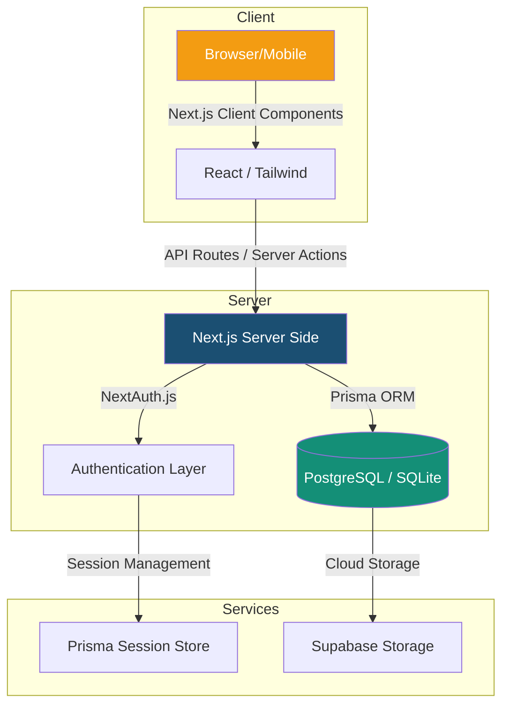

# 🏥 Shifa-Connect | الشفاء كونيكت

<div align="center">


**La plateforme "Mission Control" pour les médecins d'excellence en Algérie.**
*Gestion de cabinet médical moderne, bilingue et ultra-performante.*

[](https://nextjs.org/)
[](https://www.typescriptlang.org/)
[](https://www.prisma.io/)
[](https://tailwindcss.com/)

[Démonstration](#-démonstration) • [Fonctionnalités](#-fonctionnalités) • [Architecture](#-architecture) • [Installation](#-installation) • [Contribution](#-contribution)

</div>

---

## 📋 Aperçu

**Shifa-Connect** est une solution SaaS de pointe conçue pour révolutionner la gestion des cabinets médicaux privés en Algérie. Alliant une esthétique "Mission Control" à une robustesse technique, elle permet aux praticiens de se concentrer sur l'essentiel : **le soin patient.**

### 🌟 Points forts
- 🚀 **Performance Exceptionnelle** : Rendu hybride (SSR/ISR) avec Next.js 15.
- 🌍 **Localisation Totale** : Support bilingue (FR/AR), gestion des 58 Wilayas, NIN, et Carte Chifa.
- 🎨 **UI/UX Premium** : Interface dynamique, responsive et accessible, conçue pour un flux de travail sans friction.
- 🔐 **Sécurité de Données** : Scoping de données par médecin et protection robuste des dossiers médicaux.

---

## 🏗 Architecture du Système



---

## ✨ Fonctionnalités Clés

| Module | Description |
| :--- | :--- |
| **📈 Dashboard** | Statistiques en temps réel, graphiques de consultations et monitoring d'activité. |
| **👥 Patients** | Dossiers bilingues complets, antécédents, allergies et recherche intelligente. |
| **🩺 Consultations** | Prise de notes structurée, paramètres vitaux (TA, IMC, Temp) et diagnostics CIM-10. |
| **💊 Ordonnances** | Génération d'ordonnances professionnelles en PDF avec tampon numérique. |
| **📅 Agenda** | Gestion fluide des rendez-vous avec vues multiples et suivi des statuts. |

---

## 🛠 Stack Technique

### Core
- **Framework**: [Next.js 15](https://nextjs.org/) (App Router)
- **Langage**: [TypeScript](https://www.typescriptlang.org/)
- **Base de données**: [Prisma](https://www.prisma.io/) (PostgreSQL/SQLite)
- **Authentification**: [NextAuth.js](https://next-auth.js.org/) & [Supabase](https://supabase.com/)

### UI/UX
- **Style**: [Tailwind CSS 4](https://tailwindcss.com/)
- **Composants**: [shadcn/ui](https://ui.shadcn.com/)
- **Icônes**: [Lucide React](https://lucide.dev/)
- **Animations**: [Framer Motion](https://www.framer.com/motion/)

### Outils
- **Formulaires**: React Hook Form + Zod
- **Graphiques**: Recharts
- **PDF**: @react-pdf/renderer

---

## 🚀 Installation Rapide

### 1. Prérequis
- Node.js 20+ ou Bun 1.1+
- Une instance PostgreSQL (ou SQLite par défaut)

### 2. Setup
```bash
# Cloner le dépôt
git clone https://github.com/votre-org/shifa-connect.git

# Installer les dépendances
bun install

# Configurer l'environnement
cp .env.local.example .env.local

# Initialiser la base de données
bunx prisma db push
bunx prisma db seed
```

### 3. Lancement
```bash
bun run dev
```

---

## 🤝 Contribution

Nous encourageons les contributions ! Que ce soit pour signaler un bug, proposer une fonctionnalité ou améliorer la documentation :

1.  **Fork** le projet.
2.  Créer une branche **Feature** (`git checkout -b feature/AmazingFeature`).
3.  **Commit** vos changements (`git commit -m 'Add AmazingFeature'`).
4.  **Push** sur la branche (`git push origin feature/AmazingFeature`).
5.  Ouvrir une **Pull Request**.

---

## 📄 Licence

Distribué sous la licence **MIT**. Voir `LICENSE` pour plus d'informations.

---

<div align="center">

**Conçu avec ❤️ pour moderniser la santé en Algérie.**
**صمم بكل ❤️ لتحديث قطاع الصحة في الجزائر**

[Documentation](https://docs.shifa-connect.dz) • [Signaler un bug](https://github.com/votre-org/shifa-connect/issues)

</div>
