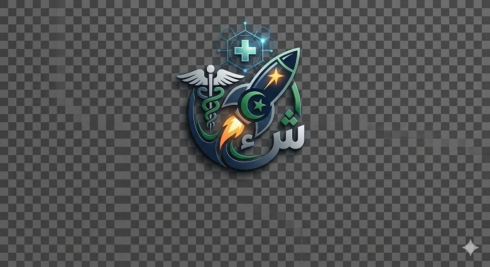
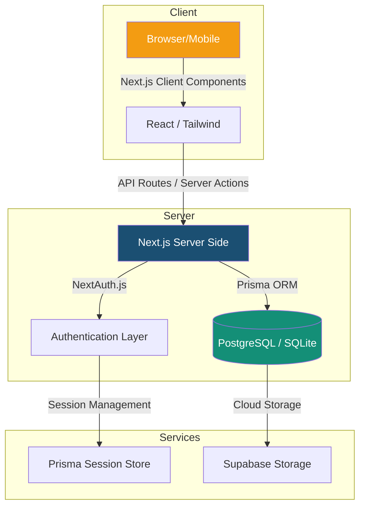
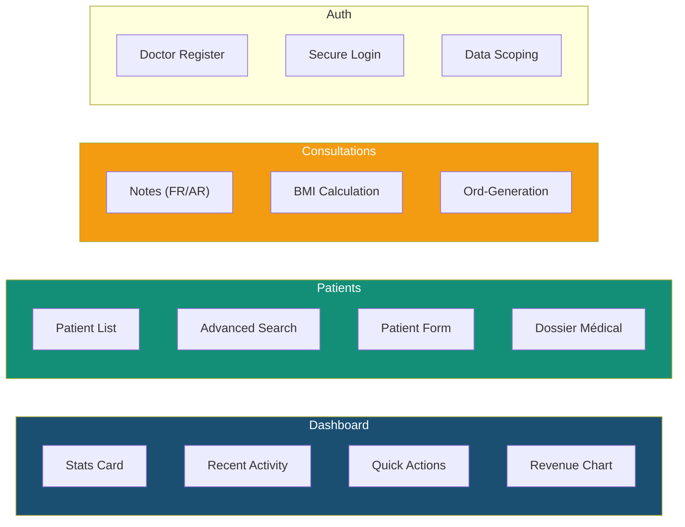
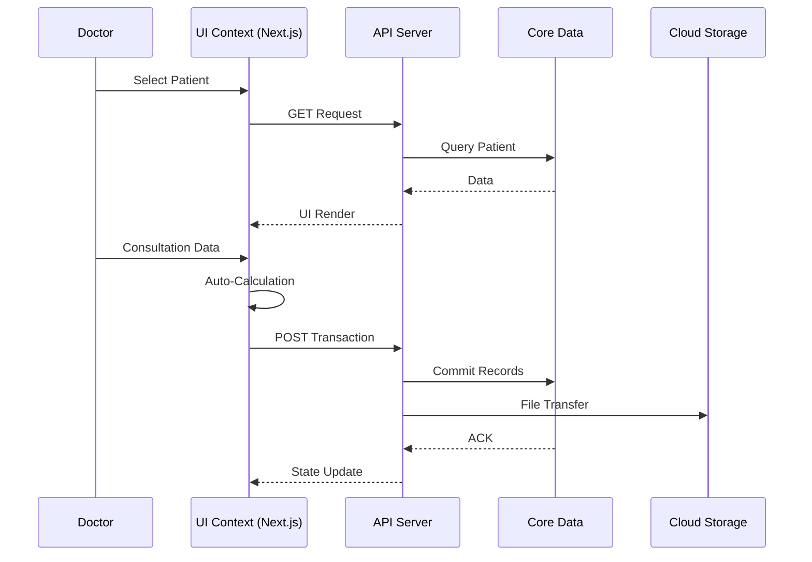
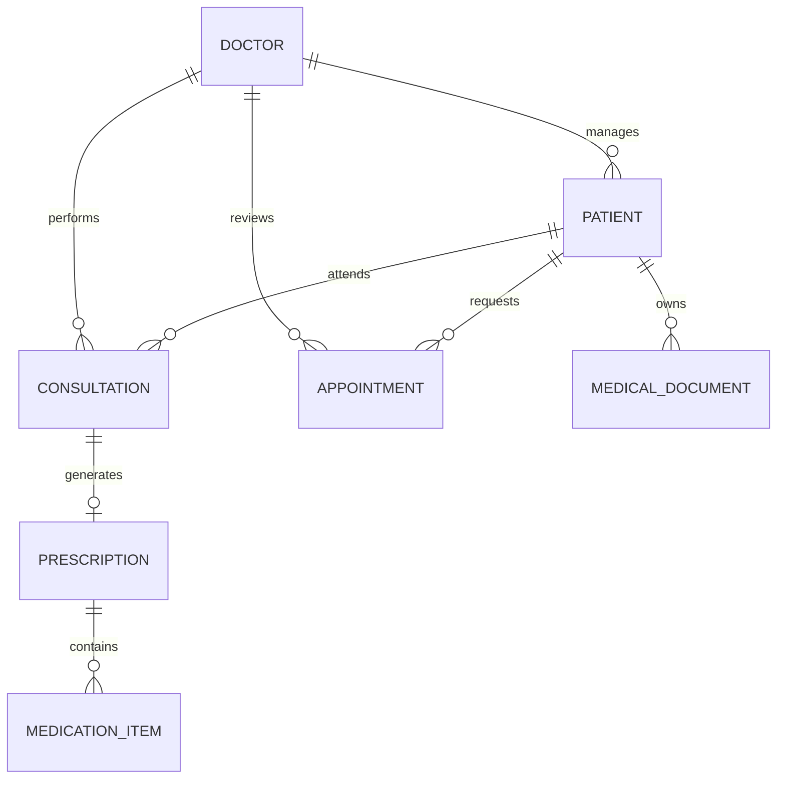
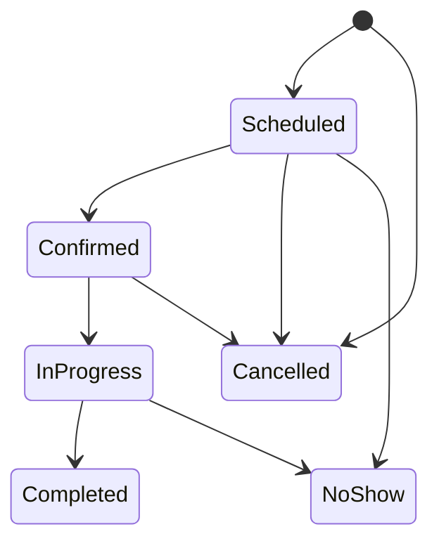

# 🏥 Shifa-Connect | الشفاء كونيكت

---

```mermaid
graph TD
    subgraph Client
        UI["Browser/Mobile"] --> |"Next.js Client Components"| FE["React / Tailwind"]
    end

    subgraph Server
        FE --> |"API Routes / Server Actions"| BE["Next.js Server Side"]
        BE --> |"Prisma ORM"| DB[("PostgreSQL / SQLite")]
        BE --> |"NextAuth.js"| Auth["Authentication Layer"]
    end

    subgraph Services
        Auth --> |"Session Management"| Session["Prisma Session Store"]
        DB --> |"Cloud Storage"| Supa["Supabase Storage"]
    end

    style BE fill:#1B4F72,color:#fff
    style DB fill:#148F77,color:#fff
    style UI fill:#f39c12,color:#fff
```

---

```mermaid
graph LR
    subgraph Dashboard
        Stats["Stats Card"]
        Activity["Recent Activity"]
        Actions["Quick Actions"]
        Revenue["Revenue Chart"]
    end

    subgraph Patients
        List["Patient List"]
        Search["Advanced Search"]
        Form["Patient Form"]
        Detail["Dossier Médical"]
    end

    subgraph Consultations
        Notes["Notes (FR/AR)"]
        Vitals["BMI Calculation"]
        Prescription["Ord-Generation"]
    end

    subgraph Auth
        Register["Doctor Register"]
        Login["Secure Login"]
        RLS["Data Scoping"]
    end

    style Dashboard fill:#1B4F72,color:#fff
    style Patients fill:#148F77,color:#fff
    style Consultations fill:#f39c12,color:#fff
```

---

```mermaid
sequenceDiagram
    participant Doctor
    participant UI as UI Context (Next.js)
    participant API as API Server
    participant DB as Core Data
    participant Storage as Cloud Storage

    Doctor->>UI: Select Patient
    UI->>API: GET Request
    API->>DB: Query Patient
    DB-->>API: Data
    API-->>UI: UI Render

    Doctor->>UI: Consultation Data
    UI->>UI: Auto-Calculation
    UI->>API: POST Transaction
    API->>DB: Commit Records
    API->>Storage: File Transfer
    DB-->>API: ACK
    API-->>UI: State Update
```

---

```mermaid
erDiagram
    DOCTOR ||--o{ PATIENT : manages
    DOCTOR ||--o{ CONSULTATION : performs
    DOCTOR ||--o{ APPOINTMENT : reviews
    PATIENT ||--o{ CONSULTATION : attends
    PATIENT ||--o{ APPOINTMENT : requests
    CONSULTATION ||--o| PRESCRIPTION : generates
    PRESCRIPTION ||--o{ MEDICATION_ITEM : contains
    PATIENT ||--o{ MEDICAL_DOCUMENT : owns
```

---

```mermaid
stateDiagram-v2
    [*] --> Scheduled
    Scheduled --> Confirmed
    Scheduled --> Cancelled
    Confirmed --> InProgress
    Confirmed --> Cancelled
    InProgress --> Completed
    InProgress --> NoShow
    Scheduled --> NoShow
    [*] --> Cancelled
```
